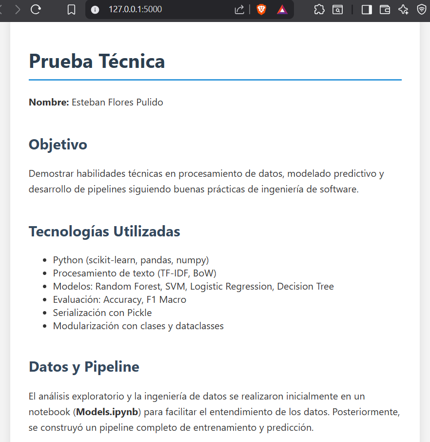

# Proyecto de Clasificación de Noticias

Este proyecto clasifica titulares de noticias en diferentes categorías usando un modelo de machine learning entrenado con texto y características adicionales.

## Requisitos

Este proyecto está desarrollado y probado con **Python 3.11.12**.  
Se recomienda usar esta versión para evitar problemas de compatibilidad del modelo almacenado.

## Instalación

### 1. Crear y activar entorno virtual

Se recomienda crear un entorno virtual para aislar las dependencias del proyecto.

```bash
# Conda (Recomendado)
conda create -p venv python=='version' -y
conda create -p venv python==3.11.12 -y  # Recomendado

# Windows
conda activate .\venv

# macOS/Linux
conda activate ./venv
```

```bash
# Windows/macOS/Linux
python3 -m venv venv
```

### 2. Activar entorno

```bash
# Conda (Recomendado)

# Windows
conda activate .\venv

# macOS/Linux
conda activate ./venv
```

```bash
# Python

# PowerShell
.\venv\Scripts\activate

# o en CMD
.\venv\Scripts\activate
```

### 3. Instalar dependencias

```bash
pip install -r requirements.txt
```

### 4. Correr pipeline de entrenamiento

```bash
python -m src.pipeline.train_pipeline
```

```bash
python .\train.py
```

### 5. Ejecutar API de Flask

```bash
flask run
```



## Estructura del proyecto

📁 src/

    ├── components/
    ├── pipeline/
    ├── utils.py
    ├── logger.py
    ├── exception.py
    └── train.py

📁 templates/

    ├── home.html
    └── predict.html

📁 static/

    └── imagen-1/

📁 artifacts/

    ├── model.pkl
    ├── bow_vectorizer.pkl
    ├── scaler.pkl
    └── label_encoder.pkl